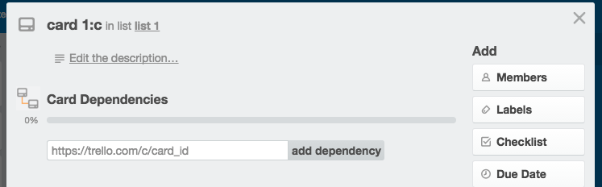
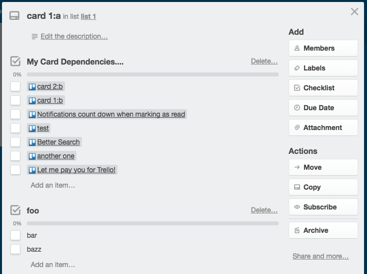
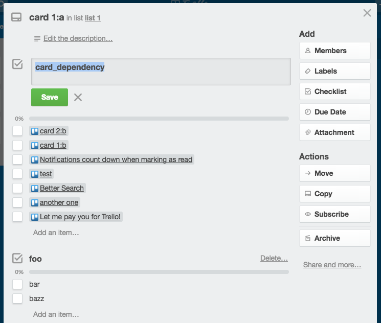

Trello Card Dependency
======================

### Gertting started

- install the [extension](https://chrome.google.com/webstore/detail/trello-card-dependency/fpjmmfimiceofligmjbaicjieolmbcop)
- open your Trello Card

If you dont have any existing checklist that you're using to keep track of your dependencies, that's ok.

#### First Time

If you have an existing checklist that you're using to keep track of your dependencies,
simply rename the checklist to `card_dependency` and refresh the page.

#### Before

#### Rename Checklist

#### After

### Releasing A New Version

- make code changes + git commit (don't bump package.json version, this is done as part of `cut_release`)
- npm run cut_release
- git fetch
- git rebase
- git push
- git push origin --tags
- check the [travis build](https://travis-ci.org/amcmillan01/trello_card_dependency)

### License

Licensed under The MIT License (MIT)

For the full copyright and license information, please view the LICENSE.txt file.