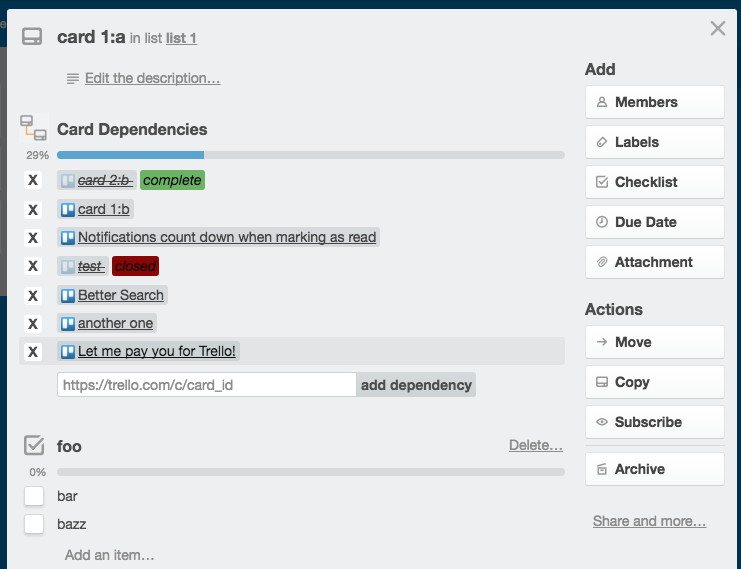

Trello Card Dependency
======================

### Gertting started

- install the extension
- open your Trello Card

If you dont have any existing checklist that you're using to keep track of your dependencies, that's ok.

#### First Time

If you have an existing checklist that you're using to keep track of your dependencies,
simply rename the checklist to `card_dependency` and refresh the page.

#### Before

#### Rename Checklist

#### After

### License

Licensed under The MIT License (MIT)

For the full copyright and license information, please view the LICENSE.txt file.